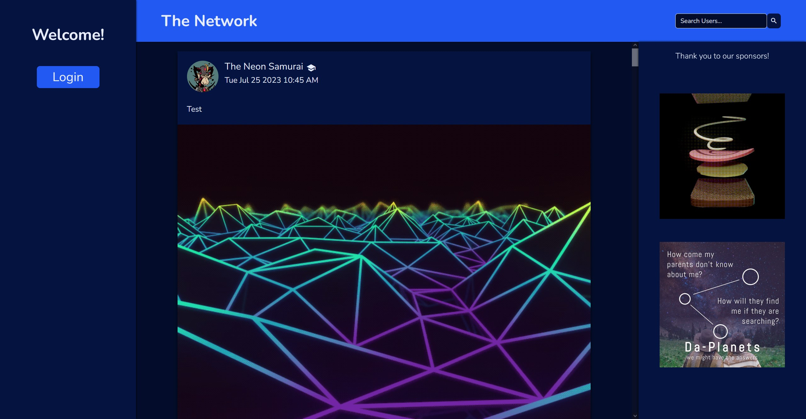

 

# Network

## Summary

Network is a social media client-side application utilizing VueJS and Boise Codeworks' Network API allowing for posts and user profiles. 

## Technologies Used

- VueJS for the Frontend Javascript Framework
- RESTful API conventions in order to have consistent API naming conventions
- Auth0 for user authentication

## What I learned
This app only focused on utilizing VueJS Framework, and so I get very comfotable with the workflow of Vue and Vue-Router library. Specific highlights of this app us rendering Not-Found page when a user profile is not found in the API, using navigation guards and programmatic routing when needed.
